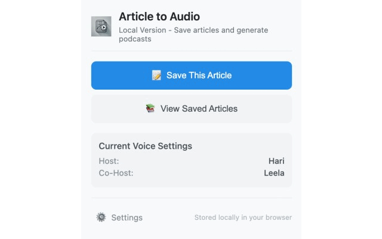

# Article to Audio: Local Version

## Installation

### Chrome Web Store (Recommended)
1. Visit the [Chrome Web Store page](https://chrome.google.com/webstore/detail/YOUR_EXTENSION_ID) for this extension
2. Click "Add to Chrome" to install the extension
3. The extension icon will appear in your browser toolbar

### From Source Code
1. Clone this repository or download the ZIP file
2. Open Chrome and go to `chrome://extensions/`
3. Enable "Developer mode" in the top right corner
4. Click "Load unpacked" and select the extension folder
5. The extension icon should now appear in your toolbar

A Chrome extension that allows you to save web articles locally and convert them into audio podcasts without relying on any external storage or cloud services (except for OpenAI API for content generation).

## Features

- **Article Capture**: Extract article content from web pages with a single click
- **Local Storage**: Save articles to IndexedDB in your browser - no cloud storage required
- **Audio Generation**: Generate audio podcasts from your saved articles using OpenAI API
- **Podcast Script Generation**: Convert articles into conversational podcast scripts with multiple voices
- **Privacy-focused**: All your data stays in your browser - only article text is sent to OpenAI for processing
- **Export/Import**: Export your article library to move between devices

## How to Use

1. **Initial Setup**:
   - Click the extension icon and go to "Settings"
   - Enter your OpenAI API key (required for all generation features)
   - Configure voice preferences if desired

2. **Save an Article**:
   - Browse to an article you want to save
   - Click the extension icon and select "Save This Article"
   - The article will be extracted and saved locally

3. **Generate a Podcast**:
   - Go to "View Saved Articles" from the extension popup
   - Select one or more articles
   - Click "Generate Podcast"
   - Choose your generation options
   - Wait while the podcast is generated

4. **Listen or Download**:
   - Play your generated podcast directly in the browser
   - Download the audio file to your device

5. **Manage Your Library**:
   - Export your entire library as a backup
   - Import previously exported libraries
   - Clear data when no longer needed

## Requirements

- Chrome browser (version 88 or later)
- OpenAI API key with access to GPT and audio models 
- This uses gpt-3.5-turbo and tts-1 model which consume much less credits compared to gpt4o.

## Privacy

- All article content is stored locally in your browser using IndexedDB
- No data is transmitted except to the OpenAI API when generating content
- Your OpenAI API key is stored securely in your browser's local storage

## Limitations

- Storage is limited by your browser's IndexedDB capacity
- Audio generation requires an internet connection and valid OpenAI API key
- Processing large articles or generating long podcasts may consume significant OpenAI API credits

## License

MIT License
